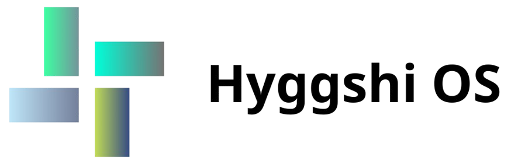

# Hyggshi OS Developer



[](https://github.com/HyggshiOSDeveloper/Hyggshi-OS-project-center/releases)


Hyggshi OS Developer là một dự án phát triển hệ điều hành mini dựa trên Roblox Studio. Mục tiêu là cung cấp giao diện và chức năng độc đáo cho người dùng.

## Features
- Giao diện đẹp mắt.
- Tính năng Zashi Messaging.
- Tích hợp tính năng timeout màn hình.


## Installation
1. Clone repository này:
   ```bash
   git clone https://github.com/HyggshiOSDeveloper/Hyggshi-OS-project-center.git

## Compliance
[](https://github.com/ROBLOX)

This product does not violate Roblox or third party standards and is an unofficial product. It is not released by any professional team or organization. Some ideas are based on Windows, real OS or other operating systems, including in-game. The idea and scenario started in 2023. At the moment, the project has the following versions:

Hyggshi OS 1.3 New Update

Hyggshi OS 2.1

Hyggshi OS Developer

Hyggshi OS operating system center

Hyggshi OS 1.5 Pro
